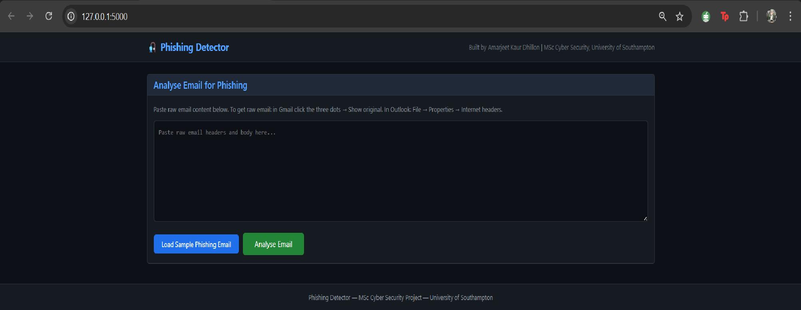
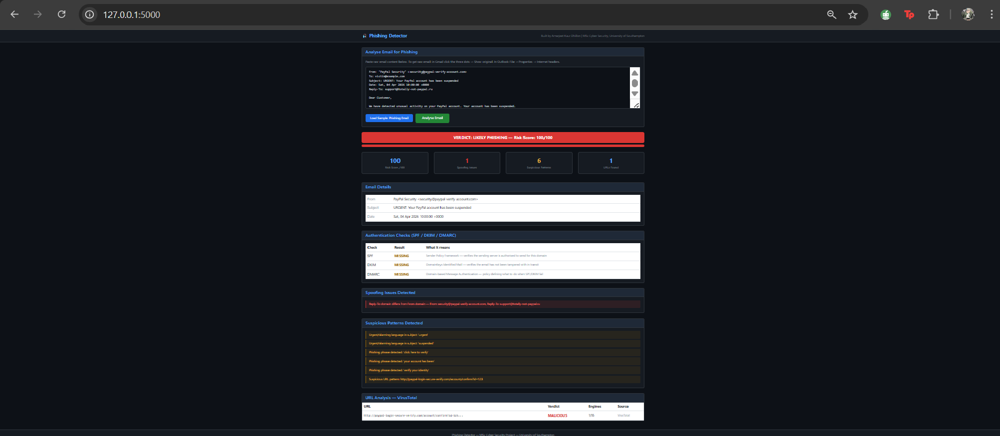

Phishing Email Detector

An intelligent phishing email analyser that checks emails for spoofing, authentication failures, suspicious patterns, and malicious URLs. Produces a risk score and verdict for each email analysed.

Built as part of MSc Cyber Security — University of Southampton.

Features
- SPF, DKIM, and DMARC authentication checking
- Sender spoofing detection — Reply-To vs From domain mismatch
- Display name impersonation detection for trusted brands
- Suspicious keyword and phishing phrase detection
- URL extraction and VirusTotal API scanning
- Risk scoring system 0-100 with verdict — Likely Phishing, Suspicious, Likely Legitimate
- Sample phishing email loader for demonstration
- Clean dark-themed SOC-style dashboard

Tech Stack
- Python 3.14
- Flask (web framework)
- VirusTotal API (URL scanning)
- Bootstrap 5 (frontend)
- Python email library (header parsing)

How to Run

1. Clone the repository
git clone https://github.com/AmarjeetkaurDhillon/phishing-detector.git
cd phishing-detector

2. Create virtual environment
python -m venv venv
venv\Scripts\activate

3. Install dependencies
pip install -r requirements.txt

4. Create .env file
VIRUSTOTAL_API_KEY=your_virustotal_key_here

5. Run the app
python app.py

6. Open in browser
Go to http://127.0.0.1:5000

7. Test it
Click Load Sample Phishing Email then click Analyse Email

How to get raw email headers
Gmail: Open email, click three dots, click Show original
Outlook: File, Properties, Internet headers
Copy the entire content and paste into the analyser

Author
Amarjeet Kaur Dhillon
MSc Cyber Security — University of Southampton
dhillonamarjeetkaur207@gmail.com
GitHub: https://github.com/AmarjeetkaurDhillon